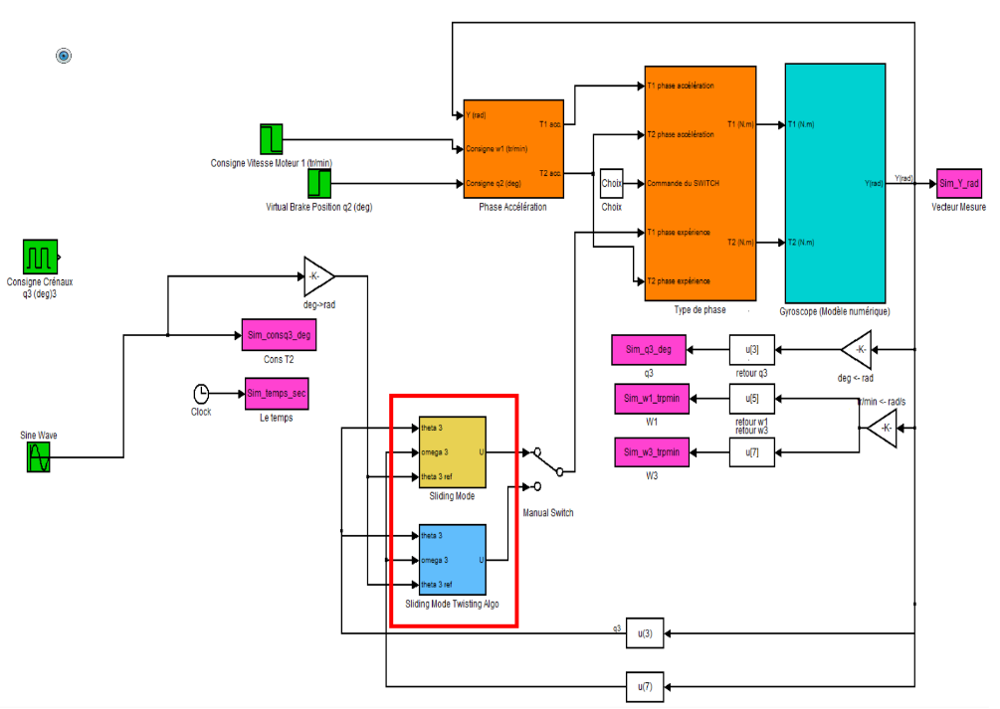

# Engineering study: Gyroscope modelling and controller scaling

This project is my work on a use case for **"Robust and Optimal Commands"** as a 5th Year **Engineering student at ESTACA**

## Abstract

This project goal was to take the *simple* use case of a gyroscope, scale different controllers such as P, PD, Sliding Mode order 1 & 2 *(Super Twisting Algorithm)*, then benchmark them to end up with the best answer to the specifications. In the end we choose the controller with the best ratio between output precision regarding the instruction and command solicitations.

## Disclaimer

I had some trouble recovering this project report from school, 2 years after graduation. So I know the report is not in the best shape but I still wanted to keep it on this Git to show my work on this specific subject. Moreover, this project was graded largely by our teacher running our simulation and oral defense. Thus, this report is clearly not have a lot of explanations and is more an equation and simulation results showcase than a full engineering report.

## Summary

### I. Simulink Gyroscope Model

- **1. Eigenvalue calculation**
- **2. Open-Loop Analysis**
- **3. Proportional controller synthesis**

### II. Non-linear robust command

- **1. *Kp* and *Kd* gains**
- **2. Result Anaysis**
- **3. Sine wave response**
- **4. Sliding Mode order 1**
- **5. Sliding MOde order 2**

### III. Conclusion

## Command Test Model

## Credits

This work was done with my former school colleagues :

- **Raphael MARTENS**
- **Antoine MORIN**
- **Mathieu SOUSA**

And our teacher help, **Dr. Moussa BOUKNIFER**
